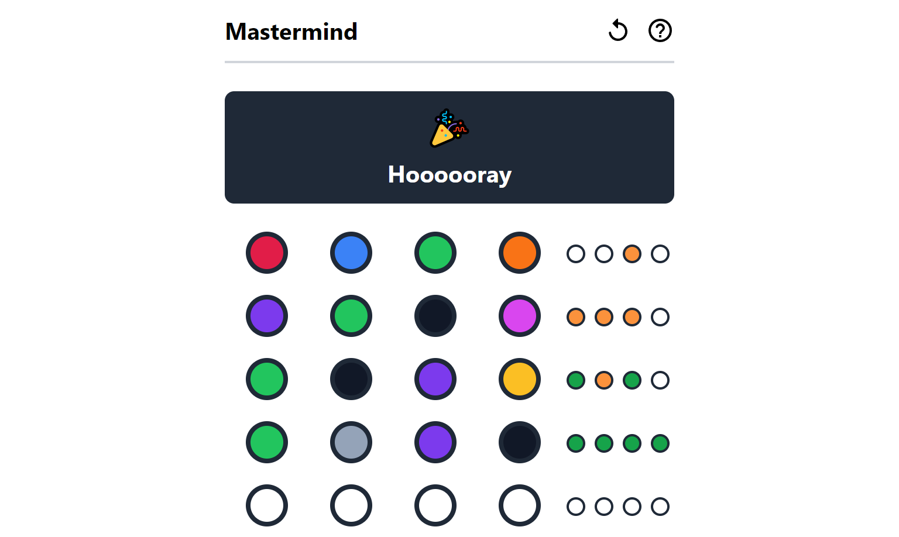

# Mastermind

> Yet another Mastermind game implementation

## Play

https://master-mind.surge.sh

## Tech Stack

[React](https://reactjs.org/),
[TypeScript](https://typescriptlang.org/),
[Tailwind CSS](https://tailwindcss.com/),
[Vite](https://vitejs.dev/),
[Vitest](https://vitest.dev/)

## Development
Requirement: [**Node.js**](https://nodejs.org/)

1. Install dependencies `npm install`
2. Run dev server `npm run dev`
3. Open `http://localhost:3000/`

Build production version `npm run build`

## License

[MIT](LICENSE)
